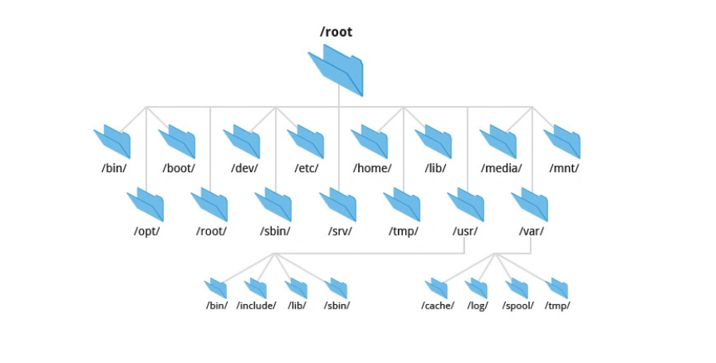

[TOC]
# NJU-OS 07 访问操作系统中的对象

## 引入：有哪些操作系统中的对象
- 文件：有 “名字” 的数据对象
  - 字节流（终端输入，random）
  - 字节序列（普通文件）
  - 文件访问API：open,close,read,write,lseek,dup...
- 进程：
  - 进程 = 运行的状态机
  - 进程管理的 API：fork,exec,exit,wait...
- 线程：
- 连续的内存段：
  - 可以“连续的内存段”看作一个对象
    - 可在进程中共享 ？
    - 可以映射文件
  - 内存管理API: mmap,munmap,mprotect,msync.
- 同步对象：
- 设备对象：
- 网络套接字：

## 文件访问与文件描述符


- 在cpp中想要访问一个堆上的东西，需要使用指针。

- 进程想访问操作系统环境中的文件，也需要使用指针。

- 进程通过逻辑上与其关联的 **FDT (File Descriptor Table)** 中的 **fd** 来访问打开的文件。状态机视角下的进程与打开的文件关系如下图：
  <details><summary><strong>进程、文件描述符、打开文件表、源文件之间的关系简图</strong></summary>

  ```

          进程A                         进程B
          +-------------------+         +-------------------+
          |   Registors       |         |   Registors       | 
          |   memoryBlocks    |         |   memoryBlocks    |         
          |   fd_table[]      |         |   fd_table[]      |
          |   0 → stdin       |         |   0 → stdin       |
          |   1 → stdout      |         |   1 → stdout      |
          |   2 → stderr      |         |   2 → stderr      |
          |   3 → struct file | ←----→  |   4 → struct file |  
          +-------------------+         +-------------------+
                    ↓                           ↓
                  +-------------------------------+
                  |        struct file            | ←【系统级打开文件表(OFT)】
                  |   - offset                    |   内核维护的全局结构体，记录：
                  |   - mode (O_RDWR)             |    • 当前文件偏移量(offset)
                  |   - refcount=2                |    • 访问模式(mode)
                  +-------------------------------+    • 引用计数(refcount)
                                |                    【关键特性】：
                                |                      • 不同进程的fd可指向同一个OFT项 
                                |                      • fork()会复制fd但共享OFT (部分操作系统中)
                                |                      • dup()会增加OFT引用计数
                                ↓                   
                        +-----------------+         
                        |  struct inode   | ← 文件系统元数据  
                        |  - permissions  |         
                        |  - disk blocks  |
                        +-----------------+

  ```


</details> 

### 文件描述符 (File Descriptor)
- 指向操作系统文件对象的指针
  - 存放在 FDT (file Descript Table)中。
  - 程序只能通过整数编号访问。
  - FDT逻辑上来说是进程状态机的一部分。
  - 实际上FDT存放在内核中的 PCB (Program Control Block) 部分。
  - 附：
    <details>
    <summary><strong>Linux内核组成示意图（含PCB位置）</strong></summary>

    ```markdown
    +-------------------------------+
    |          User Space           | ← 用户进程运行区域（如应用程序）
    +-------------------------------+
    |          System Calls         | ← 用户态与内核态的接口（如 read/write）
    +-------------------------------+
    |                               |
    |  +-------------------------+  |
    |  |       Process Mgmt      |  | ← 进程管理子系统
    |  |  +-------------------+  |  |
    |  |  |     **PCB**       |  |  | ← 进程控制块（每个进程一个）
    |  |  | (Task Struct)     |  |  |
    |  |  +-------------------+  |  |
    |  +-------------------------+  |
    |                               |
    |  +-------------------------+  |
    |  |    Memory Mgmt          |  | ← 内存管理（如页表、虚拟内存）
    |  +-------------------------+  |
    |                               |
    |  +-------------------------+  |
    |  |    File System          |  | ← 文件系统（如 ext4、NTFS）
    |  +-------------------------+  |
    |                               |
    |  +-------------------------+  |
    |  |    Device Drivers       |  | ← 设备驱动（如磁盘、网卡）
    |  +-------------------------+  |
    |                               |
    +-------------------------------+
    |          Hardware             | ← 物理硬件（CPU、内存、磁盘等）
    +-------------------------------+

    ```
    </details>
- 访问抽象为文件对象需要操作指针
  <details>
  <summary><strong>部分syscalls 实现方式</strong></summary>

  - open
    ```cpp
    p = malloc(sizeof(FileDescriptor));
    ```
  - close
    ```cpp
    delete(p);
    ```
  - read/write
    ```cpp
    *(p.data++);
    ```
  - lseek
    ```cpp
    p.data += offset;
    ```
  - dup
    ```cpp
    q = p;
    ```
  </details>

### 文件描述符的分配

- **总是分配最小的未使用的文件描述符**
- 进程能够打开文件的最大数目有两个限制
  - ulimit -n (进程层级限制)
  - sysctl fs.file-max (系统层级限制)

### 文件描述符 中的 offset
- 文件描述符自带一个 offset ❓
  JYY 讲的真的是对的吗？
- 实际上通过之前的简图可以发现，**FDT** 并不真的**直接指向文件本体**。而是指向了封装了打开的文件的信息的结构体。
- 这一结构体名称叫做 “file" 存储了与打开的文件有关的一切信息。作为 fd 和 文件的中间层。 offset 就 存储在中间层中。


### WinDows 中的 文件描述符
Windows 操作系统中行使 Linux 操作系统中 **FD** 类似职能的东西叫做 **Handle(把手；握把；把柄)**。
- 比 file descriptor 更像 “指针”：coding中的 fd 实际上是 **FDT** 的 Index ， 但是Handle不是，他更加抽象，并不对应任何的底层中的东西，仅仅给了一个访问文件的接口，是更加高级的抽象。
- 

Windows Handle 的面向工程的设计
- 默认 handle 在创建 子进程 的时候 **不继承** (和Unix实现相反)
  - 可以通过在 创建子进程 的时候设置 blnheritHandles ，或者在运行时修改。
  - “最小权限原则”

## 访问操作系统中的对象

Linux系统中 “一切皆文件” 。 Linux系统 将操作系统中的 大多数资源 (硬件设备、管道、套接字等) 抽象为 文件。

所以在Linux系统中，想要访问一个操作系统中的对象的行为最后都会归结为访问文件。

### 操作系统中的文件
**FHS（Filesystem Hierarchy Standard，文件系统层次结构标准）**
- FHS 是 Linux 和其他类 Unix 操作系统中目录结构的标准化规范，定义了不同目录的用途、存放的文件类型以及它们的层级关系。例如：
  - /bin：存放基础系统命令（如 ls, cp）。
  - /etc：存放系统配置文件。
  - /home：存放用户个人文件。
  
  <center>linux 系统的文件目录结构</center>
- enables software and user to predict the location of installed files and directories。例子：macOS 不遵循 FHS , 但是Linux 遵循。
